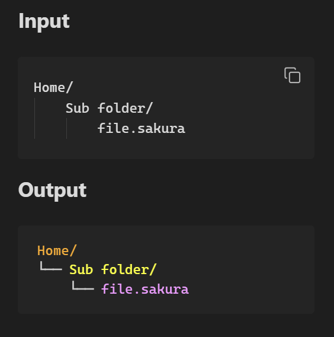
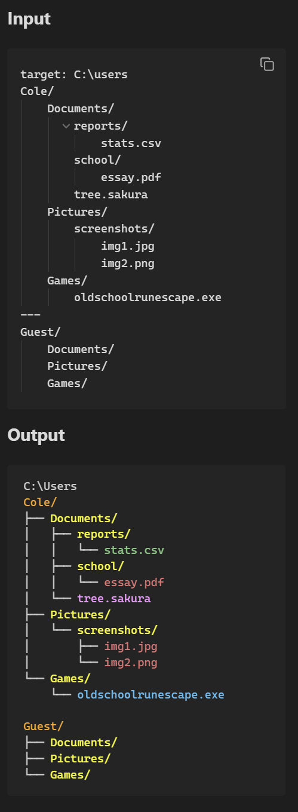

# Sakura

## Overview

Sakura is a tree visualization tool for simplifying the design of file systems or other tree-like structures before they are created. Sakura diagrams are color-coded and great for project documentation or presentations. 





## Install & Usage

### Obsidian
1. Settings > Community Plugins > Browse
2. Search "Sakura"
3. Install and Enable

**Manual install**
1. Download `main.js`, `manifest.json`, `styles.css` from the [latest release](https://github.com/Colciferr/sakura/releases/latest)
2. Put them in `<vault>/.obsidian/plugins/sakura`
3. Enable in Settings > Community Plugins

### Usage

````
```sakura
home/
    documents/
        notes.txt
    scripts/
        deploy.py
```
````

### CLI

Setup:

1. `git clone https://github.com/Colciferr/sakura.git`
2. `cd sakura`
3. `npm install`
4. `npm run build`

### Usage
- REPL mode: `node dist/cli.js` then `:render`, `:clear`, `:quit`
- File mode: `node dist/cli.js example.sakura`

## Syntax Reference 

[SYNTAX.md](SYNTAX.md)

## LICENSE

[LICENSE](./LICENSE)

